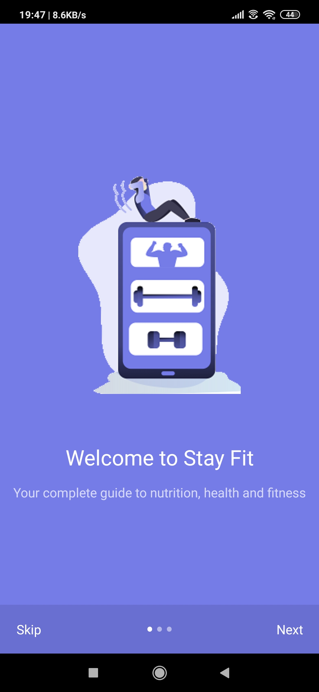
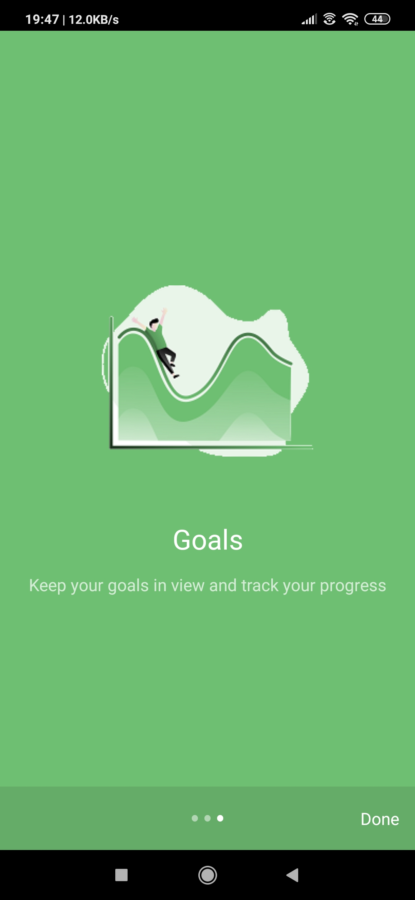
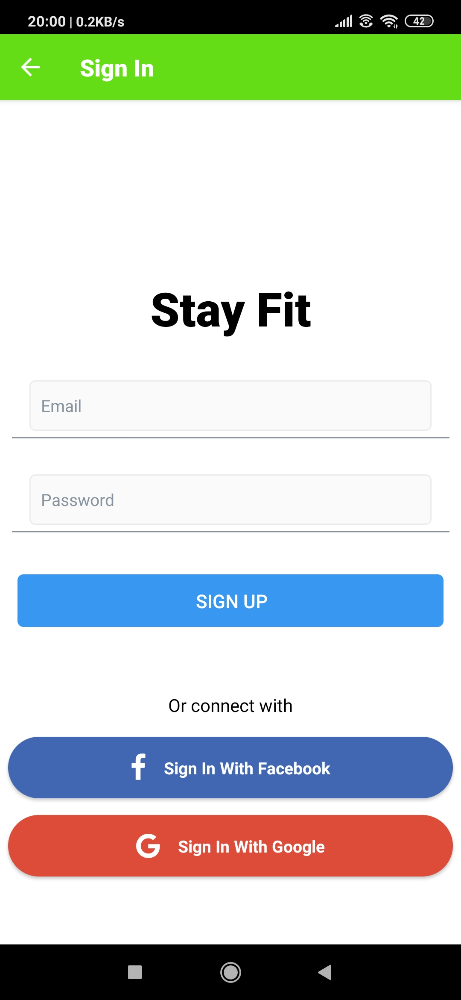
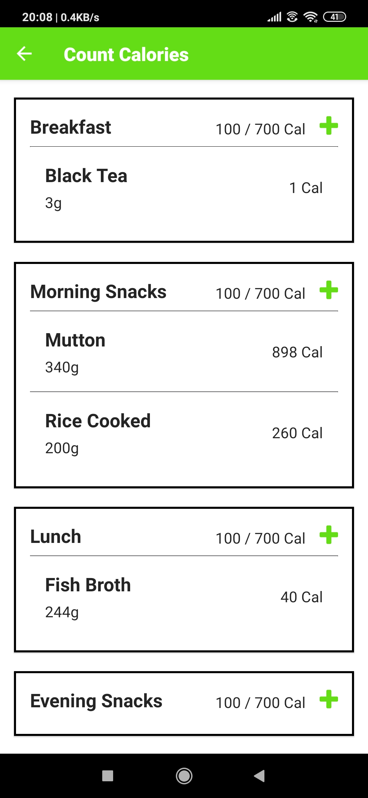

<div align="center">

# StayFit-React-Native

[](https://reactnative.dev/docs/getting-started)
[](mongodb.com "MongoDB")
[](https://code.visualstudio.com/ "Visual Studio Code")

</div>

StayFit is a modern calorie counting react native app that makes nutrition tracking easy.

## Technology
The frontend of StayFit is built using React Native, Redux and React Navigation.  The backend has been developed using ExpressJS and MongoDB as the database.  For details on the data models and implementations, visit the backend repo [here](https://github.com/SayanSahu99/StayFit-Server).  All food and nutrition data comes from the [Edamam Food Database API](https://www.edamam.com/).

* React Native
* Redux
* Formik
* NodeJS
* Express
* MongoDB

## Features
* Authentication using JWT.
* Search for food through the Edamam Food Databases
* Add foods to your daily log, differentiated by meal (breakfast, lunch, dinner, morning sancks, evening snacks)
* View food log for any day of your choosing using the date navigator on the home page
* Modify serving sizes of foods in your log
* Remove foods from your log
* Set daily calorie and nutrient goals

## Demo

<div align="center">

<h4 align="center">Onboarding Screen</h4>




<h4 align="center">Start Screen &nbsp&nbsp&nbsp&nbsp | &nbsp&nbsp&nbsp&nbsp Sign Up Screen &nbsp&nbsp&nbsp&nbsp | &nbsp&nbsp&nbsp&nbsp SignIn Screen</h4>




<h4 align="center">Details Screen &nbsp&nbsp&nbsp&nbsp | &nbsp&nbsp&nbsp&nbsp Target Weight Screen &nbsp&nbsp&nbsp&nbsp | &nbsp&nbsp&nbsp&nbsp Home Screen</h4>


<h4 align="center">Search Screen &nbsp&nbsp&nbsp&nbsp | &nbsp&nbsp&nbsp&nbsp Food Screen &nbsp&nbsp&nbsp&nbsp | &nbsp&nbsp&nbsp&nbsp Meals Screen</h4>




<h4 align="center">Water Screen &nbsp&nbsp&nbsp&nbsp</h4>


</div>

## Installation

1. Clone project

```
git clone https://github.com/SayanSahu99/StayFit-ReactNative
```

2. cd into folder

```
cd stay-client
```

3. Download dependencies

```
yarn
```

4. Install expo-cli

```
npm install -g expo-cli
```

5. create .env

```
EDAMAM_APP_ID= <>
EDAMAM_APP_KEY= <>
BASE_URL=<server url>
```

6. Start

```
expo start
```

